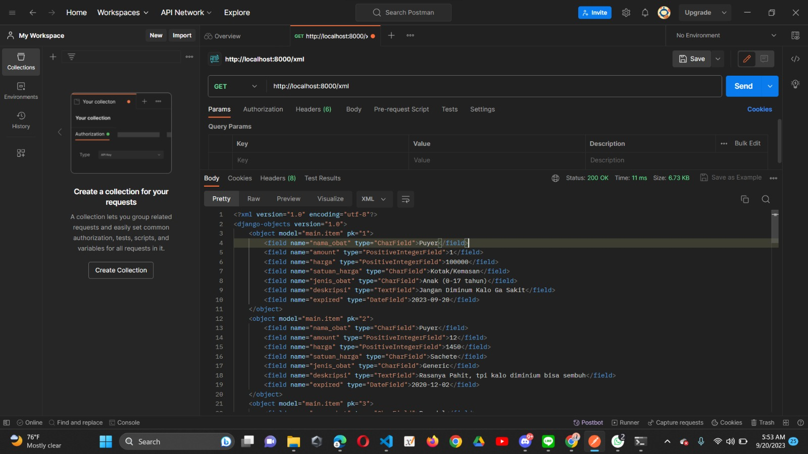
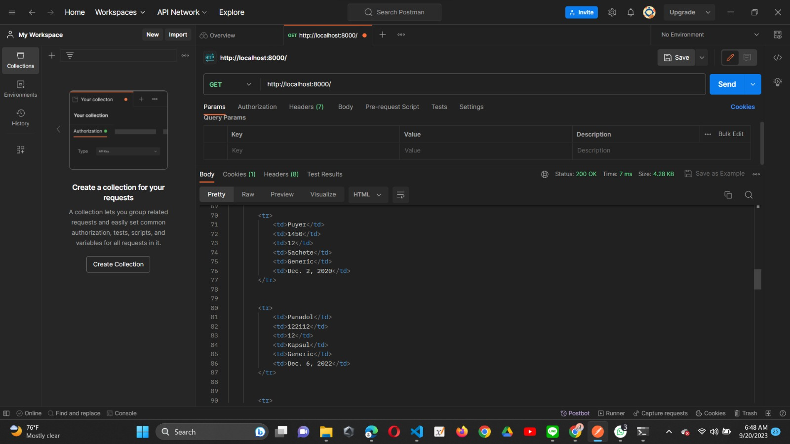

Nama    : Rakha Davin Bani Alamsyah

NPM     : 2206082650

Kelas   : PBP F

Jurusan : Sistem Informasi-Fasilkom UI

Link : 
https://github.com/rakhadavin/Tugas2-ManageVent/tree/mainBranch (Github)
https://managevent01.adaptable.app/main (Addaptable)

Selamat Datang di Repository saya. Repository ini berisi file-file untuk Tugas 2 PBP, yaitu penerapan Model-View-Template (MVT). Hasil Deployment website ini, akan saya namakan ManageVent. Makna dari ManageVent sendiri adalah sesuai panduan dan arahan tugas 2, kami diminta membuat penerapan MVT untuk melakukan pengelolaan inventris. Dengan demikian ManageVent memiliki arti web yang berfungsi untuk anda dapat melakukan management inventoris dan segala keperluan Anda lainnya.

Sekian dan Terimakasih

# TUGAS 2

# 1. Jelaskan bagaimana cara kamu mengimplementasikan checklist di atas secara step-by-step (bukan hanya sekadar mengikuti tutorial).

step 1 (Inisiasi Ide):
Dengan Memanfaatkan ChatGpt saya mendapatkan insgiht mengenai conoh penerapan pengelolaan inventori. Salah satunya adalah di Apotek. salah satu permasalahan apoteker yaitu, mereka harus menghapal jumlah, harga, jenis, nama, kegunaan dari masing-masing obat yang ada di apotek, sekalipun ada pencatatan itu hanya di buku saja, rentan hilang dan tidak ada "Backup". Dengan demikian saya memanfaatkan Tugas 2 ini untuk mebantu apoteker, dengan membuat form yang nantinya akan ditampilkan dalam bentuk tabel-tabel data mengenai metadata masing-masing obat yang ada di apotek

step 2 (Membuat Project dan App 'main'):
Saya memberi nama ManageVent untuk nama project saya, dan terdapat app bernama 'main', dimana dalam app tersebut ada class Item beserta atribute sesuai dengan ketentuan yang ada di tugas 2.

step 3 (Routing):
Kemudian saya melakukan konfigurasi url (routing) agar lebih mudah dicari menggunakan search engine. Konfigurasi ini saya lakukan berserta dengan pengaturan views yang berkesinambungan dengan url dan juga template yang berisi file html dan css, untuk ditampilkan dalam web.

step 4 (Pengaturan Models):
Saya membuat form untuk diisi dan disimpan dalam database, yang nantinya bisa ditampilkan sebagai metadata dari masing-masing obat.

disini saya menggunakan saya hanya menggunakan modul dari django.db.models, untuk melakukan pemodelan dalam database. Validasi dan batasan input dalam form tersebut juga saya lakukan, sebagai best practice.  

kemudian selain atribute yang diwajibkan saya juga membuat artribute yang menurut saya dibutuhkan untuk kasus permaslahan apotek ini dengan spesifikasi  sebagai berikut :

    nama_obat --> CharField #nama obat
    amount --> IntegerField() #stok obat tersedia
    harga --> PositiveIntegerField() #harga per apa

    satuan_harga --> CharField, berupa dropdown dengan  menu yang terdapat dibawah ini :
                        pilihan_jenis_satuan_harga = {
                            ("s","1 Strip"),
                            ("b","Botol/Sirup"),
                            ("k","Kotak/Kemasan"),
                            ("c","1 Butir Kapsul"),
                        }

    jenis_obat --> CharField, dropdown dengan daftar sebagai berikut :
                        pilihan_jenis_obat ={
                            ("h","Herbal/Suplemen"),
                            ("a", "Alergi"),
                            ("g","Generic"),
                            ('r', "Racik"),
                            ("An","Khusus Anak (0-17 tahun)"),
                            ("pd","Penyakit dalam"),
                            ("ot","Penyakit Orang Tua"),
                            
                        }
    
    

    deskripsi --> TextField(), akan berisi kegunaan obat, dosis, ukuran, komposisi, dan sebagainya.
    expired --> CharField( max_length=8,default=dateNow.strftime("%d-%m-%Y")) --> tanggal expired obat dengan format (dd-mm-yyyy)
    

step 5 (Membuat fungsi pada views.py):
fungsi yang saya buat pada views.py yang ada di app main bernama home, yang akan mengembalikan file html yang saya buat di folder templates, untuk ditampilkan pada laman web.

isi file home.html --> menampilkan, nama Program-nama app, nama mahasiswa, kelas. 

# 2. Buatlah bagan yang berisi request client ke web aplikasi berbasis Django beserta responnya dan jelaskan pada bagan tersebut kaitan antara urls.py, views.py, models.py, dan berkas html.

# 1                         2                         3                  4                5
[Request Client]   -->   [urls.py]           -->      [views.py]                 -->   [models.py]
contoh (..../main)      ("home/", "views.home")      (def home(){ 
                                                return....  home.html, context}) 

                                                        |
                                                        v   
                                                [HTML Templates] (get home.html)
                                                        |
                                                        v
                                                    [Response]
                                                        |
                                                        v
                                                [Client Browser] (menampilkan file homt.html)

PENJELASAN :
1. client request halaman web, dengan url pattern tertentu, misal (ManageVent/main). (routing)
2. url menerima request, dan mencari jenis pattern url yang sesuai(ManageVent/main) dan ternyata pattern tersebut berkaitan dengan fungsi yang ada di views, misal url nya : ("home/", "views.home")  maka fungsi yang akan dicari : "views.home" --> mencari fungsi 'home' di dalam file views.py
3. kemudian urls.py memberi respon berupa mengirimkan request / sinyal ke views.py dan mencari function 'home'
4. Pada views.py terdapat function 'home' yang mengeembalikan file 'home.html, kembali mengirim permintaan untuk mencari file bernama 'home.html' pada folder templates untuk dirender ke tampilan web
5. models.py akan berfungsi sebagai blueprint untuk struktur data atau model-data yang akan digunakan oleh aplikasi kita, dilengkapi denga pendefinisian model, dan skema database/ Bahasa mudahnya ialah berguna untuk melakukan pemodelan data yang berisi attribute tertentu, yang juga dapat ditampilkan ke halaman web dengan mengintegrasikannya melalui file html.

# 3. Jelaskan mengapa kita menggunakan virtual environment? 
Virtual Environment dibuat agar mempermudah developer dalam melakukan developing web berbasis python. Hal tersebut dapat berupa :

a. Isolasi Proyek : hal ini diperlukan agar proyek tidak bentrok dengan proyek lain dan tetap memiliki path/jalur nya sendiri

b. Kemudahan Tracing : tracing yang dimaksud ialah mulai dari debugging, tracing error, mencari solusi error, bahkan kita dengan mudah dapat mencari file model,url, views, dll untuk masing-masing app. dapat dibayangkan jika terdapat banyak app dan semua file untuk masing-masing app yang berbeda  disatukan hanya berdasarkan jenis file saja ( views.py, urls.py, models.py) tanpa ada foldering yang rapi, sungguh sangat berantakan, sulit untuk dimengerti terlebih jika kita bekerja dengan team, hal ini sungguh memberatkan team, bahkan hal yang tidak diinginkan seperti error yang tidak terduga dapat terjadi saat mengubah satu bagian dari file tersebut padahal line yang terdapaat error tersebut tidak pernah diubah. Hal ini dikarenakan kesinmbungan diantaranya.

c. Keamanan : virtusl environment dapat membantu mengurangi resiko yang mungkin timbul akibat menginstall package yang tidak terverifikasi. Sehingga jika1 file terkena virus atau semacamnya, file file yang terpisah dari file terindikasi virus tersebut dapat diselamatkan dan diamankan lebih awal, dan langkah preventif menjadi efektif sebelum langkah recovery dijalankan.

d. Efisiensi dan Produktifitas : dengan melakukan foldering, kita dapat bekerjasama dengan team di wakt yang bersamaan tanpa mengganggu kinerja progrrammer lain di file lain. Dengan demikian proses developing akan semakin cepat selesai.

e.Untuk dapat dijalankan di versi python yang berbeda-beda, dan tidak terjadi masalah dengan versi package yang tidak sesuai, atau versi python nya.

# 4. Apakah kita tetap dapat membuat aplikasi web berbasis Django tanpa menggunakan virtual environment?

Ya bisa, hanya saja kita akan lebih sulit melakukan tracing file, lebih sulit dalam mengelola dan pengaturan file. Dari segi resiko, ketika 1 file di ubah oleh lebih dari 1 programmer, dan sifatnya tidak update on realtime, maka akan terjadi ambiguitas dan file terancam banyak terdapat error bahkan rusak. Dengan demikian untuk memperbaikinya perklu waktu lagi, dan hal ini menyebabkan ketidakefisiensian kinerja.

# 5. Jelaskan apakah itu MVC, MVT, MVVM dan perbedaan dari ketiganya.

DEFINISI SECARA GARIS BESAR :

Models : komponen ini berisi tentang logika bisnis dan status data yang ada di dalam aplikasi. Kompnen ini bertugas untuk mendapatkan dan memanipulasi data (CRUD), berkomunikasi dengan urls, controller, database. 

Views : menangani interface atau tampilan untuk user, sebagai implementasi dari controller dan berkomunmikasi dengan model untuk ditampilkan kepada user di halaman web. Views akan berisi file-file html, css, javascript, dan sebagainya sebagai pengatur dalam melakukan interaksi yang dinamis kepada user (penampil komponen UI)

#                                                   MVC: (Popular)
Models : komponen ini berisi tentang logika bisnis dan status data yang ada di dalam aplikasi. Kompnen ini bertugas untuk mendapatkan dan memanipulasi data (CRUD), berkomunikasi dengan urls, controller, database.

Views : menangani interface atau tampilan untuk user, sebagai implementasi dari controller dan berkomunmikasi dengan model untuk ditampilkan kepada user di halaman web. Views akan berisi file-file html, css, javascript, dan sebagainya sebagai pengatur dalam melakukan interaksi yang dinamis kepada user (penampil komponen UI)

Controller : jembatan antara views dan models, dimana berperan sebagai controller yang akan melangsungkan interaksi agar kesinambungan antara views dengan models dapat berjalan dengan baik dan web dapat dinikmati secara interaktif dan dinamis untuk user. Hal ini juga berisi logic-logic interaktif, seperti contoh dalam penggunaan validasi pengguna, yg berkatidan pada kemanan data ang terdapat di dalamnya.

perbedaan signifikan ::
# 1. bussines logic (logika aplikas) terpisah dari model (layer UI, lapisan interface)
# 2. karena file file saling terpisah, maka perubahan yang terjadi dalam file file yang ada secara bersamaan, tidak akan mengganggu satu sama lain
# 3. Kompleksitas yang semakin tinggi, karena kurangnya konektivitas dari komponen yang ada.
# 4. file-file terkait dengan tampilan, disimpan terpisah semua berdasarkan masing-masing halaman web, atau fungsionalitas

#                                                       MVVM (Best): 
Models : secara konsep models tetaplah menjadi komponen logika dalam code kita, perbedannya dalam MVVM ini, ia menerima dan mengirim request ke repository, dan penyimpanan juga

Views : secara konsep sama sama untuk menampilkan komponen UI kepada user, dan Views dalam MVVMN akan menerima response dari Views-Model

View-Models : secara mayoritas apa yang terjadi di UI, dilakukan di Views-Models ini, tanpa mengetahui views mana (app) yang memnaggilnya. Seacar konsep VM ini sama dengan controller, hanya saja cara kerjanya yang sedikit berbeda, yaitu ia melakukan pengaturan value via observable. Obsevable adalah sejenis kelas unutk objek yang dapat diamati lewat interface.

VM dapat berisi logic code untuk melakukan request ke Model, dan Models akan merespon dengan mengembalikan apa yang dibutuhkan oleh VM tadi, yang diambil melaui repository, local data source, remote data source.

perbedaan signifikan ::
# 1. bekerja dengan konsep observable (clas Obsevable) sebagai penghubung dengan model dan views
# 2. views tidak akan pernah berkomunikasi langsung dengan models, Views-Models sebagai jembatannya fasilitasnya
# 3. Observable function harus dibuat pada setiap komponen UI
# 4. Mudah untuk unit test
# 5. Tidak ideal untuk projek kecil

#                                                    MVT: 

Model : Sekumpulan data set yang sengaja disimpan untuk di proses dalam app kita. set -set data tersebut disimpan dala bentuk connected table, tabel yang saling terkoineksi satu sama lain. Kita bisa melakukan CRUD (Create, Read, Update, Delete) data melalui command-command tertentu, yang nantinya data dari tabel tersebut dapat ditampilkan di halaman web, dan ini berkesinambungan dengan Templates.

Views : sebuah fungsi dalam python yang menerima request serta mengirim response ke halamnan web. reponse yang diberikan dapat berupa html file, redirect, error trigger ( 404 error ) 

Templates : mudahnya dapat kita katakan sebagai Dynamic HTML. Karena pada templates ini, kita dapat melakukan assign value dalam file html yang nilainya dapat berubah ubah. File html dapat diubah dan disisipkan logic code seperti looping, conditional, dan sebagainya karena dalam MVT Django ini terdapat Django Template Language  (DTL), yang memiliki syntax nya sendiri untuk melakukan perubahan nilai secara mandiri sesuai dengan data data yang diminta dan tersedia.

Ada dua jenis templat:

{{ variabel }} Digunakan untuk variabel yang berbeda.
 Digunakan untuk meletakkan logika, loop dan link.

Pembeda :

# 1. Dapat dilakukan dynamic html
# 2. Dapat digunakan sebagai penerima request sekaligus pemberi Responses
# 3. lebih muda dimodifikasi, file lebih terstruktur, dan mudah dimengerti jalur file nya
# 4. terdapat url's paterns mapping, memudahkan routing

#
# TUGAS 3

# Apa perbedaan antara form POST dan form GET dalam Django?

--> GET : metode yang digunakan oleh web untuk "mendapatkan/membaca" data-data dari server (Web Server)

- Jika berhasil  Http return status code nya adalah 200 (OK)
- Parameter fungsi untuk pengambilan data akan diambil dari URL sebagai bagian dari Query String, dalam hal ini kita biasa melakukannya dengan sebutan "Routing"

--> POST : metode yang digunakan untuk "mengirim" data ke server (Web Server)
- Jika berhasil  Http return status code nya adalah 201 (OK)

- Parameter fungsi post tidak terlihat di tampilan web, hanya bekerja sebagai backend saja

- File yang di post dapat berupa file, form, images, dan sebagainya.

- Kapan sebaiknya menggunakan POST : saat ada perubahan data, saat ada data sensitif (lebih aman dibandingkan get)

pada akhirnya get dan post ini akan digunakan untuk web melakukan CRUD dan manipulasi data yang akan ditampilkan ke interface user

# Apa perbedaan utama antara XML, JSON, dan HTML dalam konteks pengiriman data?

HTML : HyperText Markup Language
- Untuk menampilkan dan presentasi visual data, tidak bisa melakuakn pengiriman/perubahan data kecuali dengan action yang di handle oleh javaSctripts
- Dalam penulisan syntax lebih terstruktur dan lebih nmudah dimengerti dibandingkan XML
- dapat berisi data/konten dari file dengan format data selain html, misalnya XML dan JSON
- khusus pengembangan struktur halaman web

XML : eXtensible Markup Language
- kompatibel dengan berbagai bahasa pemrograman, sehingga termasuk sebagai format data yang popular
- Ada tag tag yang dibuat kustom untuk mewakili item data ( Tag XML berperan sebagai 'key' dalam XML, dan isinya berperan sebagai 'valuenya') 
- Tidak mendukung array
- Struktur data lebih kuat
- Lebih kompatibel dalam menggabungkan data dan informasi dibandingkan dengan JSON
- Cocok untuk API yang membutuhkan struktur data kompleks atau terdapat banyak struktur data yang perlu didefinisikan
- Biasanya digunakan untuk melakukan transfer "data produk" karena lebih kompleks, shingga dengan XML akan lebih mudah dipahami

JSON : JavaScript Object Notation
- Lebih modern
- Data disimpan dalam hubungan "key" dan "value"
- sangat mudah dipahami dan dibaca namun termasuk format data yang tidak terstruktur
- memiliki ukuran yang lebih kceil dari XML sehingga dapat lebih efisien untuk ditransfer lewat jaringan.
- Syntax nya mirip dengan notasi JavaScripts
- Mendukung Array
- Cocok untuk API dengan ukuran kecil karena mudah dibaca dan dimengerti
- Biasanya digunakan untuk melakukan transfer "data pengguna" karena lebih ringan dan kecil, shingga dengan JSON akan lebih mudah dipahami dan dibaca

# Mengapa JSON sering digunakan dalam pertukaran data antara aplikasi web modern?

1. Lebih modern
2. leibih mudah digunakan, dilihat dan dimengerti
3. Syntax lebih sederhana
4. Lebih ringkas dan mudah dalam menggunakan API
5. Bahasa Linguistik (dapat menggunakan berbagai macam bahasa Pemrograman)
6. Dukungan untuk Aplikasi Web Modern ( JSON memungkinkan aplikasi untuk mengambil data dari server tanpa harus me-refresh seluruh halaman web. ) -berbasis Ajax
7. Keamanan yang jauh lebih baik dimimliki JSON dibandingkan XML dan HTML dalam melakukan pertukaran data
8. Support Cross-Domain ( Dapat berkomunikasi dan berbagi data dengan domain lain)

# Jelaskan bagaimana cara kamu mengimplementasikan checklist di atas secara step-by-step (bukan hanya sekadar mengikuti tutorial).
0. Tidak lupa untuk memastikan kembali app yang saya buat sudah terdaftar pada prroject ini, dengan mendaftarkannya di bagian settings.py bagian app
1. Melakukan inisiasi beberapa fungsi untuk html, XML, JSON sesuai tutorial beserta masing-masing filenya.
- membuat file base.html

2.                                                             Membuat FORM
a. Pertama saya membuat models.py terlebih dahulu yang berisikan metadata mengenai produk yang akan di input (migrasi) ke dalam database sekaligus sebagai inisiasi filed ke dalam form
b. membuat class ProductForm (forms.py) yang berisikan field meta data dari masing-masing obat, dimana class tersebut mengambil data dari class Item yang ada di models.py
form akan berfungsi sebagai implementasi fields di models.py

3. kemuudian membuat pengaturan URL (routing), sama seperti tugas sebelumnya, routing yang dimaksud meliputi pengaksesan fungsi di views.py sesuai dengan arahan url yang dimaksud dan views.py akan mengembalikan file html sesuai yang diminta pada fungsi tersebut
pada dasarnya url untuk string kosong, akan menuju halaman web dengan app 'main'
4. kemudian saya lakukan routing di urls.py, 
- untuk string kosong ("main/") akan menampilkan identitas saya sebagai mahasiswa PBP F (Tugas 2) dan menampilkan tabel data obat yang telah didaftarkan dan disimpan ke database
- saya membuat button yang akan mengarahkan user ke halaman pendaftaran obat ke database, dimana url yang dimaksud adalah routing dari main/create-obat

5. Pada halaman "main/create-obat" user akan dimintai beberapa data mengenai obat yang tersedia dan akan dipasarkan di apotek, dimana seiring aktivitas penjualan seharusnya jumlah stok di database juga berkurang

6. membuat file home.html untuk menampilkan halaman web yang berisi identitas saya dan tabel data yang telah didaftarkan di database
7. membuat file create_product.html untuk memfasilitasi user mendaftarkan data-data obat pada database

BONUS:
untuk memberikan keterangan jumlah item yang sudah di daftarkan ke database, saya membuat variabel bernama "banyak_item" dan menyimpan banyak item dalam tabel tersebut. Dengan menggunakan methode "obj.count()" --> (models.Item.count()) kita akan mendapatkan banyak item yang kita dapatkan, item yang dimaksud adalah obat yang telah saya daftarkan.

models.Item akan berperan sebagai objek yang berasal dari views.py

# Mengakses kelima URL di poin 2 menggunakan Postman, membuat screenshot dari hasil akses URL pada Postman, dan menambahkannya ke dalam README.md.

akses XML : 

akses XML by ID :

akses JSON : 

akses JSON by ID : 

akses HTML (main ("")):

akses HTML (create-project) : 

# TUGAS 4

# Apa itu Django UserCreationForm, dan jelaskan apa kelebihan dan kekurangannya?

UserCreationForm adalah sebuah build-in (Django Build-in authentication System) yang disediakan oleh Django untuk membentuk objek user baru dengan spesifikasi form berupa username dan 2 password, dan merupakan inherit dari ModelForm. Dimana hal ini akan disimpan dalam database django dan akan digunakan kembali untuk implementasi login page dan seluruh hal yang berkaitan dengan akses, authentication and verify

Kelebihan :
1. progammer tidak perlu melakukan terlalu banyak function untuk validasi dan handle dalam pembuatan user baru
2. sudah langsung terhubung ke database
3. Mudah dalam pembuatannya, tidak perlu membuat form dari 0
4. Bisa dikreasikan

Kekurangan :
1. Field terbatas, jika ingin menambahkan field lain seperti nama dan email, harus memodifikasi nya dengan membuat form function sendiri
2. Field template membatasi kreativitas dan kurang relavan dengan kasus-kasus khusus yang memerlukan field field tertentu
3. Tidak mendukung peran (role), dalam form tersebut semua user dianggap sama sehingga akses dan fitur yang dapat digunakan juga sama, dengan demikian ketika kita memiliki role-role yang berbeda tentu kita harus meng-handle sendiri dengan ketentuan yang kita butuhkan.

# Apa perbedaan antara autentikasi dan otorisasi dalam konteks Django, dan mengapa keduanya penting?
Autentikasi : Proses verifikasi dan identifikasi mengenai "siapa" yang sedang login atau berada dalam web tersebut. Hal ini digunakan mengidentifikasi identitas yang mengakses web kita.

Otorisasi : Pengelolaan akses sesuai peran/role. Hal ini dimaksudkan karena masing-masing peran/role memiliki akses dan fitur yang berbeda, sehingga perlu validasi untuk memastikan "user" boleh mengakses apa saja dalam web kita. Seperti contoh, ketika kita login menggunakan akun dosen, tentu kita dapat mengubah nilai, namun ketika kita login sebagai mahasiswa, kita tidak memiliki akses untuk pengeditan nilai.

Kenapa Perlu??

- Agar tidak terjadi Ancaman dan kejahatan cyber ke dalam web kita, yang dapat membahayakan pihak manapun terlebih jika berkaitan dengan data pribadi atau data penting yang berjumlah besar. 

    Kejahatan tidak hanya dapat dilakukan ketika sesorang berhasil membongkar code (internalisasi) web, bahkan hanya dari URL saja, dapat terjadi kejahatan, karena ada kegiatan GET dan POST yang berkaitan dengan alamat web, sehingga secara otomatis apa yang ada di URL akan di ekstrak ke dalam code dan dijalankan, dikhawatirkan hal ini mengandung file/akses berbahaya, sehingga menyebabkan web kita error. Seperti contoh, web kita sedang mengunggah data,  dan URL kita seharusnya menuju server "A", karena kurangnya keamanan dan pengelolaan akses, ada sesorang yang berhasil mengarahkan kita ke Web Server miliknya, kemudian data-data penting dalam web kita diamnbildan disalahgunakan.

    beberapa ancaman Kejahatan Web :

    - SQL Injection : suntikan data berbahaya ke dalam web / database kita, karena salah masuk server yang seharusnya (Sabotase)
    - Form Tampering, mengubah data dalam e-commerce app yang dapat menipu pembeli, sehingga terjadi penuduhan kepada penjual
    - Code Injection : sabotase code, yang diubah dengan tujuan tertentu yang berkaitan dengan data dan keselamatan keamanan web
    Defaacement : memodifikasi web agar user melakukan suatu hal yang dapat mengarahkan user ke halaman target, dimana halaman tersebut berisi attacker yang akan mengambil data pribadi dan melakukan kejahatan lain.
    - Cross Site Scripting XSS : menyuntikan code yang bisa dieksekusi melalui client side browser

# Apa itu cookies dalam konteks aplikasi web, dan bagaimana Django menggunakan cookies untuk mengelola data sesi pengguna?

Cookies : proses identifikasi dan penyimpanan data pengguna yang "berhasil" mengakses web dan sudah dinyatakan aman melalui proses identifikasi, autentikasi, dan otoriasai pengguna, sehingga ketika mengakses halaman lain di web yang sama, user tidak perlu melakukan login dan ferivikasi lagi sebagai syarat keamanan.

Cookies dapat memanfaatkan "Session ID" untuk mengingat dan menyimpan data pengguna yang berhasil login dan tervalidasi aman dan disimpan pada sisi client web (browser pengguna), dengan kata lain sebagai Kartu Identitas. Session ID berupa token untuk mengenali sesi pengguna tertentu, dan bersifat unik untuk tiap pengguna. Hal ini jauh lebih aman karena session ID tidak dapat diakses oleh klient luiar web atau jaringan tak diketahui

Ketika kita membuka halaman web lain di web yang sama, web tidak perlu melakukan validasi ulang melalui login function untuk memastikan keamanan user, web hanya perlu mengambil session ID user, dan mengeceknya di penyimpanan, apakah user dengan Session ID "***" sudah pernah masuk, dan aman (Allowed) atau tidak. Session ID tidak hanya mengandung token, namun juga bisa mengandung personalisasi pengguna, seperti bahasa yang dipilih saat pertama kali mengunjungi website, sehingga ketika mengunjungi website yang sama pada sesi yang lain, tidak perlu lagi untuk melakukan pengaturan bahasa.

# Jelaskan bagaimana cara kamu mengimplementasikan checklist di atas secara step-by-step (bukan hanya sekadar mengikuti tutorial).

# a. Fungsi Login, Registrasi , dan Logout

Secara garis besar, saya hanya melakukan apa yang sudah saya lakukan di tutorial PBP, hanya sedikit modifikasi mengenai variabel, data, dan behavior lain.

-- melakukan validasi user untuk keamanan web, dengan mewajibkan user untuk melakukan login terlebih dahulu ketika ingin mengakses web, melalui :
                                    @login_required(login_url='/login')

-- pada tutorial, kita hanya memiliki 1 user, dan  ketika user lain masuk, mereka akan diarahkan ke home page yang sama, dimana data mereka tercampur menjadi 1. Kemudian saya perbaiki agar tiap user memiliki restriksi data masing-masing, sehingga keteraturan data dapat di optimalkan. Dengn cara berikut :

    `my_obats = models.Item.objects.filter(user = request.user) `

    hal diatas saya lakukan agar, web hanya menampilkan dan mengolah data user yang masuk saat itu saja tanpa mengganggu data user lain, melalui filtering user (methode filter()), request.user akan mmenyebabkan django mencari data terkait yang sesuai dengan user yang dimaksud. 

# b. Menghubungkan Item dengan User

pada class Item yang saya buat, digunakan untuk pendaftaran produk, dalam konteks web yangsaya buat yaitu obat. User berhasil masuk ke Web, akan dianggap sebagai admin sebuah apotek. Dimana tugas mereka adalah mendaftarkan banyak barang (stok), harga, kegunaan, jenis obat, expired, dan deskripsi penggunaan obat. 

Kemudian kita akan membuat form yang akan berisikan field untuk data-data obat. Instance Item dari models.py di import kedalam forms.py (function ProductForm) untuk dijadikan form yang akan diisi oleh admin apotek. Dengan bantuan Django Templates Language dan bantuan build in bawaan django pada html untuk membuat form ( {{ form.as_table}} ), form yang sudah kita buat di forms.py akan dapoat dilihat oleh user pada tampilan web mereka lewat HTML

# c. Menampilkan detail informasi pengguna yang sedang logged in seperti username dan menerapkan cookies seperti last login pada halaman utama aplikasi.

untuk menampilkan data mengenai identitas user yang sedang login, kita dapat menggunakan 
(request.user.username). Syntax ini akan mengambil username user yang terdaftar pada form ditandai dengan .user (untuk mengambil data milik user), berupa username (.username)

untuk menampilkan last session kita menggunakan (request.COOKIES['last_login']). Melakukan request ke HTTP kemudian mencari history login session user dalam cookies (.COOKIES), berupa data yang memiliki atribute bernama 'last_login', dan akan mengeembalikan informasi yang terdapat dalam 'last_login' tersebut. 

- Atribut request.COOKIES adalah sebuah dictionary yang berisi semua cookie yang dikirimkan oleh browser pengguna dalam permintaan HTTP, dan untuk mendapatkan nilainya kita dapat  menggunakan sintaks request.COOKIES['nama_cookie']

last_login merupakan attribute build-in django yang memang sudah bawaan dan default dari field yang terdapat pada form django yang sudah kita buat dengan "UserCreationForm" dimana terdapat 3 attribute (field) yaitu, username, password1, dan password2. 

Kemudian saya menambahkan sedikir sentuhan style css untuk web saya, dan beberapa saya implementsikan dari Bootstrap 5

# BONUS

untuk melakukan penambahan dan pengurangan stok pada app ini, saya membuat fungsi nambah_obat dan kurangi_obat pada views.py. ke
mudian saya menambahkan button untuk tambah dan kurangi stok pada masing masing item. Untuk menghapus item saya membuat fungsi delete_obat pada views. Agar saat di klik button tersebut merespon dengan melakukan perubahan pada item, saya melakukan salah satu implementasi regex dengan cara setiap button di klik, button akan mengirimkan button milik item maan yang di klik, dengan berupa id. Kemudian id item terpilih tersebut di kirimkan ke url, dan diambil kembali oleh fungsi yang saya buat di views.py

# selected_item = models.Item.objects.get(id=id_obat)

implementasi code diatas saya terapkan pada fungsi nambah_obat dan kurangi_obat yang terdapat pada views.py. Dimana selected_item akan berupa objek item yang berhasil terpilih melalui id yang diambil melalui url.

# href=" // syntax yang digunakan diimplementasikan menerima namespace url

pada file HTML dalam tag button saya menggunakan attribute diatas dengan maksud, setiap kali button di klik akan mengarahkan ke url tertentu sesuai fungsi , bisa menggunakan url langsung maupun namespace URL. Kemudian "obat.id" merupakan parameter yang berupa id dari item yang terpilih ( yang button nya di klik) dan id akan dikirimkan ke URL, sehingga akan terlihat id obat terpilih pada URL

kemudian ".get(id=id_obat)" digunakan untuk mendapatkan id dari url, yang kemudian dicari dalam query, item dengan id tersebut, jika hasilnya tidak NONE berarti item dengan id tersebut ada. Selanjutnya kita lakukan perubahan :

# 
selected_item.amount -=1; --> mengurangi jumlah stok
selected_item.amount +=1; --> menambah jumlah stok
selected.item.delete() --> menghapus item
# 

# TUGAS 5

# Jelaskan manfaat dari setiap element selector dan kapan waktu yang tepat untuk menggunakannya.

1. Element Selector (element):
Manfaat: Memilih semua elemen dengan nama yang cocok.
Kapan Menggunakan: Cocok untuk gaya yang akan diterapkan pada semua elemen dengan nama yang sama, misalnya, mengatur semua paragraf ("
) atau semua heading ("<h1>, "<h2>, dst.).

kurang diasarankan, karena rentan mengubah smua tag yang dimaksud tanpa sengaja
* contoh
p {
    color: blue;
}

2. Class Selector (.class):
Manfaat: Memilih elemen dengan kelas tertentu.
Kapan Menggunakan: Berguna ketika Anda ingin menerapkan gaya pada beberapa elemen yang memiliki kelas yang sama, memungkinkan penggunaan kelas yang bersifat reusable.

Biasanya digunakna untuk select elemen tertentu
* contoh
.highlight {
    background-color: yellow;
}

3. ID Selector (#id):
Manfaat: Memilih elemen dengan ID tertentu.
Kapan Menggunakan: Cocok untuk menerapkan gaya pada elemen unik yang hanya ada satu di halaman.

Biasanya digunaknan untuk selecting elemen pada JS
* contoh 
#header {
    font-size: 24px;
}

4. 4. Descendant Selector (ancestor descendant):
Manfaat: Memilih elemen yang merupakan keturunan dari elemen tertentu.
Kapan Menggunakan: Berguna ketika Anda ingin memilih elemen yang berada di dalam elemen lain, seperti memilih semua paragraf yang berada di dalam elemen dengan class tertentu.
* contoh

menjadikan selecting lebih spesifik dengan acuan elemen yang ada diluar target elemen yang dimaksud

.container p {
    margin-bottom: 10px;
}

5. Child Selector (parent > child):
Manfaat: Memilih elemen yang langsung adalah anak dari elemen tertentu.
Kapan Menggunakan: Berguna ketika Anda ingin memilih elemen yang merupakan anak langsung dari elemen lain, menghindari elemen yang adalah keturunannya.
* contoh 
ul > li {
    list-style-type: square;
}

6. Pseudo-Class Selector (:pseudo-class):
Manfaat: Memilih elemen berdasarkan keadaan atau interaksi pengguna.

Kapan Menggunakan: saat ingin merubah tampilan elemen saat berada dalam keadaan (event) tertentu, misalnya, mengubah warna tautan saat di-hover.

dapat menggunakan nnth-child(n) untuk memilih elemen ke berapa (bisa juga berpola spt genap ganjil)
* contoh 
a:hover {
    color: red;
}

7. Pseudo-Element Selector (::pseudo-element):
Manfaat: Memilih dan memodifikasi bagian spesifik dari suatu elemen.
Kapan Menggunakan: Berguna ketika Anda ingin merubah tampilan bagian-bagian tertentu dari suatu elemen, misalnya, merubah gaya teks awal atau akhir dari elemen.
* contoh 
p::first-line {
    font-weight: bold;
}

8. Global Selector (*)

menerapkakn semua perubahan style ke semua elemen dalam web

# Perbedaan Margin dan Padding

- Margin : ruang di luar batas elemen, dengan mudah dapat kita katakan sebagai jarak antar elemen. Margin digunakan untuk mengatur jarak dan ruang di luar container/sisi sisi elemen satu dengan lainnya

Sebaiknya digunakan ketika ingin mengatur jarak antar elemen, menjauhkan / mendekatkan elemen satu dengan yang lainnya, dan menjaga supaya ketika elemen lain di atur margin/paddingnya, tidak akan menimpa elemen yang kita sudah atur marginnya

- Padding : ruang yang beraada antara elemen pembungngkus  dengan elemennya (isi / konten) sendiri. Dengan mudahnya kita dapat katakan, padding adalah pengaturan jarak antara konten/isi dari sebuah tag, dengan pembungkus tag itu sendiri.

sebaiknya digunakan ketika ingin mengatur jarak internal elemen, biasanya ketika kita menerapkan warna backgorund, container pemmbungkus akan menyesuaikan panjajng (padding right left) /tinggi (padding top bottom) sebanyak jarak padding yang diterapkan, dengan kata lain container pembungkus akan bertambah panjang dengan maksud memberi ruang pada konten yang berada di dalamnya.

# Tag HTML 5

"<!--...-->	Memberi  komentar
"<!DOCTYPE> menspesifikasi document type
"<a>	untuk anchor / link(url)
"<abbr>	Specifies an abbreviation (untuk mendefinisikan suatu kata dan akan muncul ketika di hover dengan moouse)
"<acronym>	Deprecated:Specifies an acronym (akronim)
"<address>	Specifies an address element
"<applet>	Deprecated: Specifies an applet
"<area>	Specifies an area inside an image map
"<article>	New Tag: Specifies an independent piece of content of a document, such as a blog entry or newspaper article
"<aside>	New Tag:Specifies a piece of content that is only slightly related to the rest of the page.
"<audio>	New Tag:Specifies an audio file.(memasukan input audio)
"<base>	Specifies a base URL for all the links in a page
"<basefont>	Deprecated: Specifies a base font
"<bdo>	Specifies the direction of text display
"<bgsound>	Specifies the background music
"<blink>	Specifies a text which blinks
"<blockquote>	Specifies a long quotation  (untuk emasukan kutipan)
"<body>	Specifies the body element (elemen body dari html, yang beriisi isi konten)
" 	Inserts a single line break (line break)
"<button>	Specifies a push button (tombol)
"<canvas>	New Tag:This is used for rendering dynamic bitmap graphics on the fly, such as graphs or games.
"<caption>	Specifies a table caption
"
	Deprecated: Specifies centered text (teks tengah)
"<col>	Specifies attributes for table columns (membuat kolom)
"<colgroup>	Specifies groups of table columns
"<command>	New Tag:Specifies a command the user can invoke.
"<comment>	Puts a comment in the document
"<datalist>	New Tag:Together with the a new list attribute for input can be used to make comboboxes
"<dd>	Specifies a definition description
"<del>	Specifies deleted text
"
	New Tag:Specifies additional information or controls which the user can obtain on demand.
"<dir>	Deprecated: Specifies a directory list
"
	Specifies a section in a document (membeentuk bagian/division tertentu sebagai pembungkus)
"<dl>	Specifies a definition list
"<dt>	Specifies a definition term
"<embed>	New Tag:Defines external interactive content or plugin.
"<fieldset>	Specifies a fieldset
"<figure>	New Tag:Specifies a piece of self-contained flow content, typically referenced as a single unit from the main flow of the document.
"<b>	Specifies bold text
"<big>	Deprecated:Specifies big text
"<i>	Specifies italic text (italic teks)
"<small>	Specifies small text
"<tt>	Deprecated:Specifies teletype text
"	Deprecated: Specifies text font, size, and color
"<footer>	New Tag:Specifies a footer for a section and can contain information about the author, copyright information, et cetera.
"<form>	Specifies a form 
"<frame>	Deprecated:Specifies a sub window (a frame)
"<frameset>	Deprecated:Specifies a set of frames
"<head>	Specifies information about the document
"<header>	New Tag:Specifies a group of introductory or navigational aids.
"<hgroup>	New Tag:Specifies the header of a section.
"<h1> to "<h6>	Specifies header 1 to header 6
"
	Specifies a horizontal rule
"<html>	Specifies an html document
"<isindex>	Deprecated: Specifies a single-line input field
"<iframe>	Specifies an inline sub window (frame)
"<ilayer>	Specifies an inline layer
"	Specifies an image
"<input>	Specifies an input field
"<ins>	Specifies inserted text
"<keygen>	New Tag:Specifies control for key pair generation.
"<keygen>	Generate key information in a form
"<label>	Specifies a label for a form control
"<layer>	Specifies a layer
"<legend>	Specifies a title in a fieldset
"<li>	Specifies a list item
"<link>	Specifies a resource reference
"<map>	Specifies an image map 
"<mark>	New Tag:Specifies a run of text in one document marked or highlighted for reference purposes, due to its relevance in another context.
"<marquee>	Create a scrolling-text marquee
"<menu>	Deprecated: Specifies a menu list
"<meta>	Specifies meta information
"<meter>	New Tag:Specifies a measurement, such as disk usage.
"<multicol>	Specifies a multicolumn text flow
"<nav>	New Tag:Specifies a section of the document intended for navigation.
"<nobr>	No breaks allowed in the enclosed text
"<noembed>	Specifies content to be presented by browsers that do not support the "<embed>tag
"<noframes>	Deprecated:Specifies a noframe section
"<noscript>	Specifies a noscript section
"<object>	Specifies an embedded object
"<ol>	Specifies an ordered list
"<optgroup>	Specifies an option group
"<option>	Specifies an option in a drop-down list
"<output>	New Tag:Specifies some type of output, such as from a calculation done through scripting.
"
	Specifies a paragraph
"<param>	Specifies a parameter for an object
"<cite>	Specifies a citation
"<code>	Specifies computer code text
"<dfn>	Specifies a definition term
"<em>	Specifies emphasized text 
"<kbd>	Specifies keyboard text
"<samp>	Specifies sample computer code
"<strong>	Specifies strong text
"<var>	Specifies a variable
"<plaintext>	Deprecated: Render the raminder of the document as preformatted plain text
"<pre>	Specifies preformatted text
"<progress>	New Tag:Specifies a completion of a task, such as downloading or when performing a series of expensive operations.
"<q>	Specifies a short quotation
"<ruby>	New Tag:Together with "<rt> and "<rp> allow for marking up ruby annotations.
"<script>	Specifies a script
"<section>	New Tag:Represents a generic document or application section.
"<select>	Specifies a selectable list
"<spacer>	Specifies a white space
"	Specifies a section in a document
"<s>	Deprecated: Specifies strikethrough text
"<strike>	Deprecated: Specifies strikethrough text
"<style>	Specifies a style definition
"	Specifies subscripted text
"	Specifies superscripted text
"<table>	Specifies a table
"<tbody>	Specifies a table body
"<td>	Specifies a table cell
"<textarea>	Specifies a text area
"<tfoot>	Specifies a table footer
"<th>	Specifies a table header
"<thead>	Specifies a table header
"<time>	New Tag:Specifies a date and/or time.
"<title>	Specifies the document title
"<tr>	Specifies a table row
"<u>	Deprecated: Specifies underlined text
"<ul>	Specifies an unordered list
"<video>	New Tag:Specifies a video file.
"<wbr>	New Tag:Specifies a line break opportunity.
"<wbr>	Indicate a potential word break point within a "<nobr> section
"<xmp>	Deprecated: Specifies preformatted text

# kapan sebaiknya menggunakan Bootstrap dan tailwind dan apa bedanya

Tailwinds :

- menguntamakan utilitas
- kustomisasi lebih mudah dan lebih bebas
- flexibel
- Tampilan HTML menjadi lebih penuh 
- Ideal untuk project yang banyak kustomisasi

Direkomendasikan untuk dipakai ketika membuat project yang banyak kustommiasai, berkaitan dengan React.JS, Vue, dan JS

Bootstrap:
- kaya akan sumber, elemen, dan templates
- Kerangka kerja lebih terstrukutr (html)
- cocok untuk project dengan kerangka kerja yng stabil, tidak banyakk kustomisasi

Direkomendasikan menggunakan Bootstrap ketika project yang kita ambil tidak terlalu banyak perubahan, dengan responsif yang lebih baik

# Step melakukan kustomisasi pada Tugas 5

1. Kustomisasi CSS, menambahkan navbar pada home, kemudian mengatur url routing pada navigation di navbar

2. memberi template bootstrap pada tabel item, dan memberi button berwarna berbda sesuai fungsi dan arti warnanya

3. membuat tombol + obat dan logout dengan template bootstrap

4. mengatur letak elemen
    - Menjadikan navbar Fixed Position
    - memnjadikan tombol add producut dan logout menjadi floating button
    - mengubah warna latar (tujuan awal switch theme dark/light)

5. Mengatur CSS pada halaman Login dan Create product agar lebih nyama di lihat, memberi div sebagai pembungkus.

