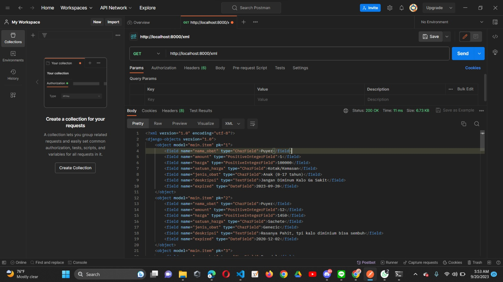
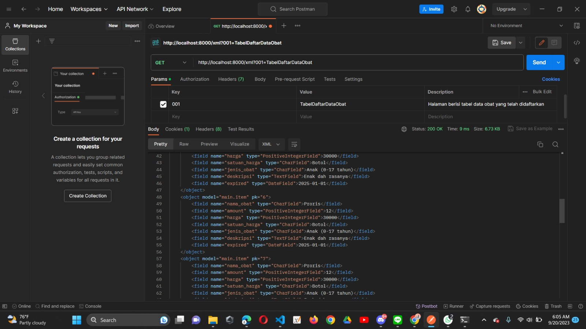
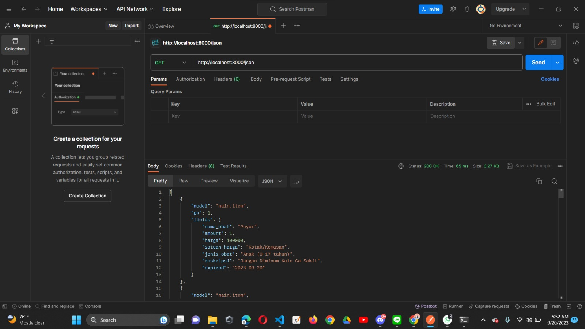
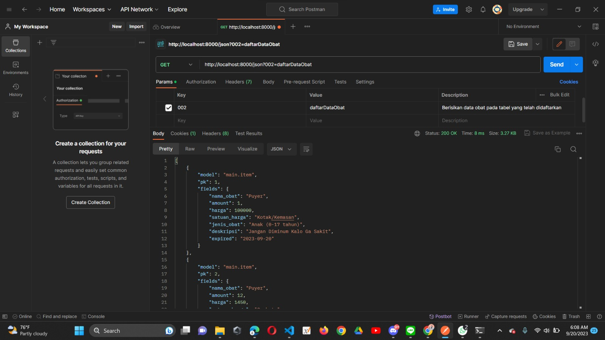
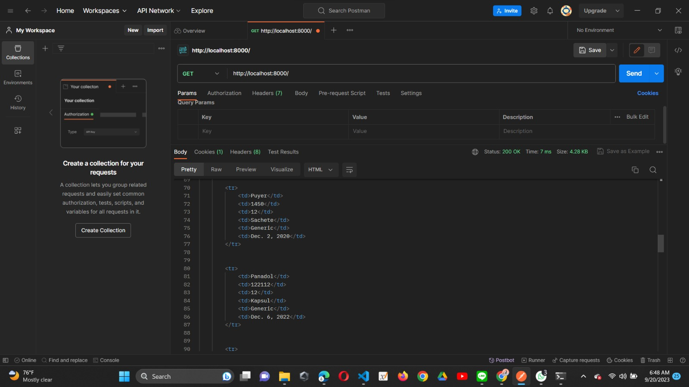
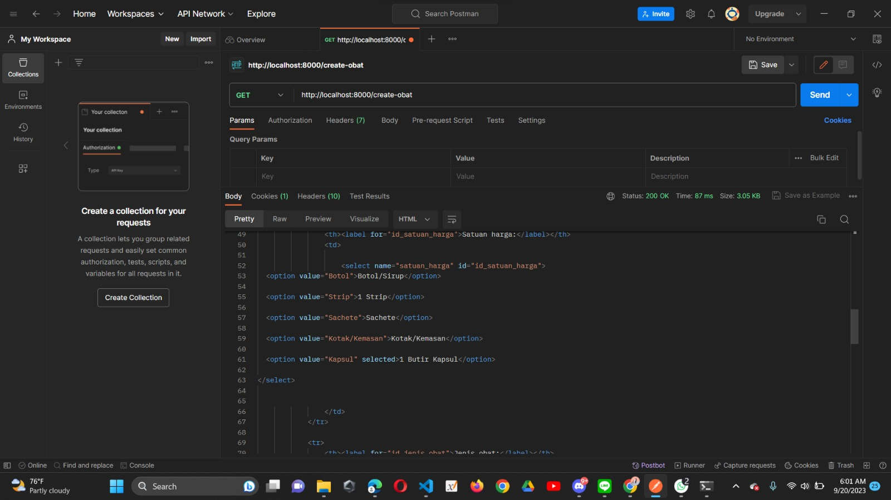

Nama    : Rakha Davin Bani Alamsyah
NPM     : 2206082650
Kelas   : PBP F
Jurusan : Sistem Informasi-Fasilkom UI
TUGAS   : 3

# Apa perbedaan antara form POST dan form GET dalam Django?

--> GET : metode yang digunakan oleh web untuk "mendapatkan/membaca" data-data dari server (Web Server)

- Jika berhasil  Http return status code nya adalah 200 (OK)
- Parameter fungsi untuk pengambilan data akan diambil dari URL sebagai bagian dari Query String, dalam hal ini kita biasa melakukannya dengan sebutan "Routing"

--> POST : metode yang digunakan untuk "mengirim" data ke server (Web Server)
- Jika berhasil  Http return status code nya adalah 201 (OK)

- Parameter fungsi post tidak terlihat di tampilan web, hanya bekerja sebagai backend saja

- File yang di post dapat berupa file, form, images, dan sebagainya.

- Kapan sebaiknya menggunakan POST : saat ada perubahan data, saat ada data sensitif (lebih aman dibandingkan get)

pada akhirnya get dan post ini akan digunakan untuk web melakukan CRUD dan manipulasi data yang akan ditampilkan ke interface user

# Apa perbedaan utama antara XML, JSON, dan HTML dalam konteks pengiriman data?

HTML : HyperText Markup Language
- Untuk menampilkan dan presentasi visual data, tidak bisa melakuakn pengiriman/perubahan data kecuali dengan action yang di handle oleh javaSctripts
- Dalam penulisan syntax lebih terstruktur dan lebih nmudah dimengerti dibandingkan XML
- dapat berisi data/konten dari file dengan format data selain html, misalnya XML dan JSON
- khusus pengembangan struktur halaman web

XML : eXtensible Markup Language
- kompatibel dengan berbagai bahasa pemrograman, sehingga termasuk sebagai format data yang popular
- Ada tag tag yang dibuat kustom untuk mewakili item data ( Tag XML berperan sebagai 'key' dalam XML, dan isinya berperan sebagai 'valuenya') 
- Tidak mendukung array
- Struktur data lebih kuat
- Lebih kompatibel dalam menggabungkan data dan informasi dibandingkan dengan JSON
- Cocok untuk API yang membutuhkan struktur data kompleks atau terdapat banyak struktur data yang perlu didefinisikan
- Biasanya digunakan untuk melakukan transfer "data produk" karena lebih kompleks, shingga dengan XML akan lebih mudah dipahami

JSON : JavaScript Object Notation
- Lebih modern
- Data disimpan dalam hubungan "key" dan "value"
- sangat mudah dipahami dan dibaca namun termasuk format data yang tidak terstruktur
- memiliki ukuran yang lebih kceil dari XML sehingga dapat lebih efisien untuk ditransfer lewat jaringan.
- Syntax nya mirip dengan notasi JavaScripts
- Mendukung Array
- Cocok untuk API dengan ukuran kecil karena mudah dibaca dan dimengerti
- Biasanya digunakan untuk melakukan transfer "data pengguna" karena lebih ringan dan kecil, shingga dengan JSON akan lebih mudah dipahami dan dibaca

# Mengapa JSON sering digunakan dalam pertukaran data antara aplikasi web modern?

1. Lebih modern
2. leibih mudah digunakan, dilihat dan dimengerti
3. Syntax lebih sederhana
4. Lebih ringkas dan mudah dalam menggunakan API
5. Bahasa Linguistik (dapat menggunakan berbagai macam bahasa Pemrograman)
6. Dukungan untuk Aplikasi Web Modern ( JSON memungkinkan aplikasi untuk mengambil data dari server tanpa harus me-refresh seluruh halaman web. ) -berbasis Ajax
7. Keamanan yang jauh lebih baik dimimliki JSON dibandingkan XML dan HTML dalam melakukan pertukaran data
8. Support Cross-Domain ( Dapat berkomunikasi dan berbagi data dengan domain lain)

# Jelaskan bagaimana cara kamu mengimplementasikan checklist di atas secara step-by-step (bukan hanya sekadar mengikuti tutorial).
0. Tidak lupa untuk memastikan kembali app yang saya buat sudah terdaftar pada prroject ini, dengan mendaftarkannya di bagian settings.py bagian app
1. Melakukan inisiasi beberapa fungsi untuk html, XML, JSON sesuai tutorial beserta masing-masing filenya.
- membuat file base.html

2.                                                             Membuat FORM
a. Pertama saya membuat models.py terlebih dahulu yang berisikan metadata mengenai produk yang akan di input (migrasi) ke dalam database sekaligus sebagai inisiasi filed ke dalam form
b. membuat class ProductForm (forms.py) yang berisikan field meta data dari masing-masing obat, dimana class tersebut mengambil data dari class Item yang ada di models.py
form akan berfungsi sebagai implementasi fields di models.py

3. kemuudian membuat pengaturan URL (routing), sama seperti tugas sebelumnya, routing yang dimaksud meliputi pengaksesan fungsi di views.py sesuai dengan arahan url yang dimaksud dan views.py akan mengembalikan file html sesuai yang diminta pada fungsi tersebut
pada dasarnya url untuk string kosong, akan menuju halaman web dengan app 'main'
4. kemudian saya lakukan routing di urls.py, 
- untuk string kosong ("main/") akan menampilkan identitas saya sebagai mahasiswa PBP F (Tugas 2) dan menampilkan tabel data obat yang telah didaftarkan dan disimpan ke database
- saya membuat button yang akan mengarahkan user ke halaman pendaftaran obat ke database, dimana url yang dimaksud adalah routing dari main/create-obat

5. Pada halaman "main/create-obat" user akan dimintai beberapa data mengenai obat yang tersedia dan akan dipasarkan di apotek, dimana seiring aktivitas penjualan seharusnya jumlah stok di database juga berkurang

6. membuat file home.html untuk menampilkan halaman web yang berisi identitas saya dan tabel data yang telah didaftarkan di database
7. membuat file create_product.html untuk memfasilitasi user mendaftarkan data-data obat pada database

# Mengakses kelima URL di poin 2 menggunakan Postman, membuat screenshot dari hasil akses URL pada Postman, dan menambahkannya ke dalam README.md.

akses XML : 

akses XML by ID :

akses JSON : 

akses JSON by ID : 

akses HTML (main ("")):

akses HTML (create-project) : 
